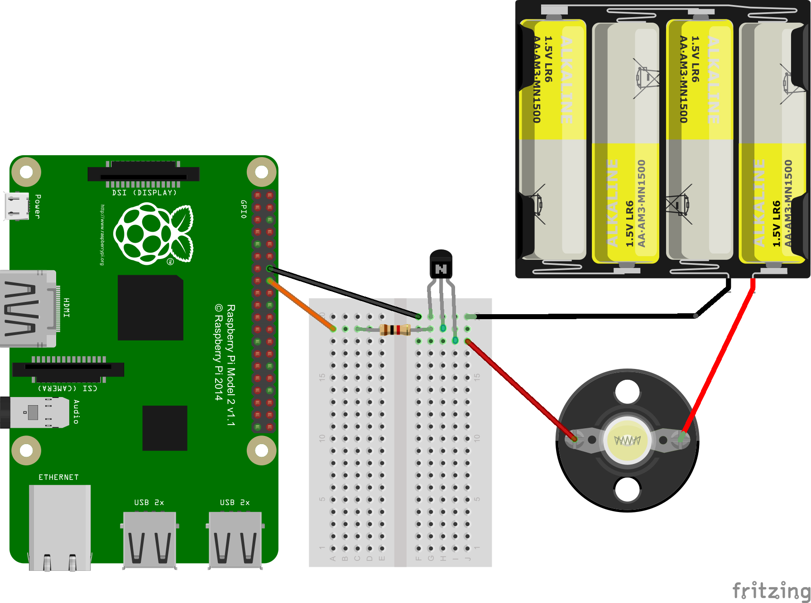
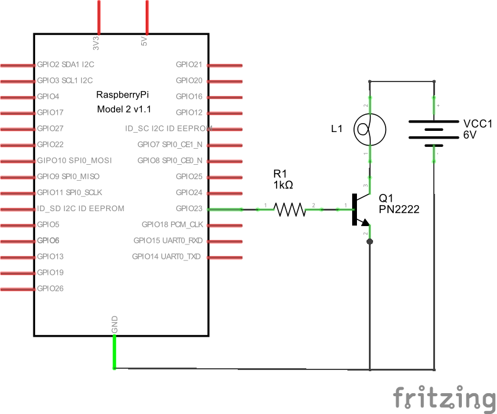

# fritzing-battery-box

## Introduction

The Fritzing software tool allows users to document their electronics
prototypes. As at version 0.9.2b, the library of parts included with
the software includes various battery parts but does not include an battery box
holding four AA batteries.

Users can import their own parts. This project seeks to add the following parts:

* battery_box_6V_4xAA: a holder for four AA batteries, branded black and
  copper
  
* battery_box_6V_4xAA_v2: a holder for four AA batteries, branded silver and
  yellow, with terminal wires close together

## Examples

### battery_box_6V_4xAA_v2

  